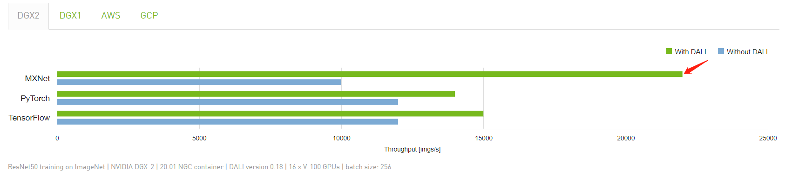

# dali-pytorch
This is a PyTorch toolkit for accelerated ImageNet training based on the distributed mode with [NVIDIA DALI](https://github.com/NVIDIA/DALI) equipped. Though with extremely high training speed, the toolkit achieves similar or higher performance than that reported in the original papers.

## Main Requirements (recommended)

* python >= 3.7.0
* pytorch >= 1.2.0
* CUDA >= 10.0
* nvidia-dali-cuda100 >= 0.23.0
* mmcv >= 1.0.5
* mxnet >= 1.6.0 (only used for preparing the dataset)

## Train
1. As shown in the [official evaluation](https://developer.nvidia.com/DALI), the MXNet data format shows notable speed advantages. We use the MXNet `.rec` dataset format for training. Please prepare the ImageNet dataset as `.rec` following ["Create a Dataset Using RecordIO"](https://mxnet.apache.org/api/faq/recordio).


2. Train your model with the following script. It is recommended to run the training code on 8 GPUs with a total batch size of 128x8. Taken MobileNetV2 training as an example,
```
sh ./scripts/train_dist.sh 8 ./imagenet-rec imagenet_train_mbv2_cfg.py
```


## Results
We evaluate our toolkit on several popular networks as follows, which achieves similar or higher performance than the original papers reported ones. All the experiments are performed on 8 TITAN-XP GPUs.

Our pre-trained models and corresponding training logs can be downloaded at [DALI_MODEL_ZOO](https://drive.google.com/drive/folders/1-KHHupxYmZClxlnmrZ5X5ndObFcp98Lv?usp=sharing).

| Model                | Reported Top-1(%) | Top-1(%) | Epochs | Time w/dali |
|----------------------|-------|---------|---------|---------|---------| 
| ResNet18 | 69.76* | 72.15 | 240 | 16h |
| MobileNetV2 | 72.0 | 72.94 | 240 | 1d4.5h |
| MobileNetV3 | 75.2 | 75.07 | 400 | 2d1.5h |
| GhostNet 1.0x | 73.9 | 73.97 | 400 | 1d21.5h |

*\* denotes the result reported in the torchvision model zoo.*<br>
*"d": day; "h": hour.*

----------------------------------

Comparisons between training w/ and w/o dali:

| Model | Method | Top-1(%) | Time |
|----------------------|-------|---------|---------| 
| ResNet18 | w/ dali | 72.15 | **16h** |
|  | w/o dali | 72.01 | 47.5h |

*The w\o dali setting is based on the lmdb data format from the codebase of [DenseNAS](https://github.com/JaminFong/DenseNAS).*

## Acknowledgement
This project is in part supported by [Horizon Robotics](https://en.horizon.ai).

The code of some models is from [ghostnet](https://github.com/huawei-noah/ghostnet/blob/master/pytorch/ghostnet.py) and [mobilenetv3](https://github.com/d-li14/mobilenetv3.pytorch). Thanks for the contribution of these repositories.

## Citation
This repository is partially based on [DenseNAS](https://github.com/JaminFong/DenseNAS). If you find this toolkit helpful in your research, please cite
```
@inproceedings{fang2019densely,
  title={Densely connected search space for more flexible neural architecture search},
  author={Fang, Jiemin and Sun, Yuzhu and Zhang, Qian and Li, Yuan and Liu, Wenyu and Wang, Xinggang},
  booktitle={Proceedings of the IEEE Conference on Computer Vision and Pattern Recognition},
  year={2020}
}
```